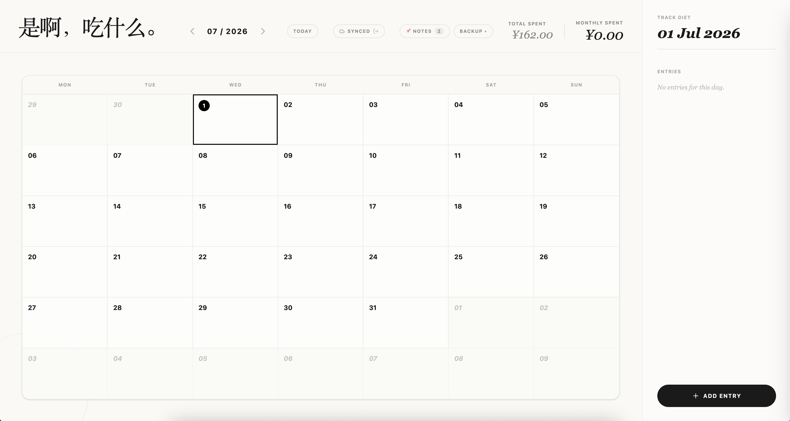

# 是啊，吃什么 · Personal Expense Log

A simple, intuitive calendar-based expense tracker for logging your daily meals and spending. Works fully offline by default — sign in with Google if you want optional cloud sync across devices.



## ✨ Features

- 📅 **Calendar-based logging** — Browse a monthly view and double-click any date to add an expense record for that day
- 🏷️ **Categories** — Six built-in categories (Food 🍔, Work 💻, Family 🏠, Activity 🏃, Shopping 🛒, Other 📦), each with its own color for quick scanning on the calendar
- 🎨 **Custom color tags** — Mark a day with a custom color (no amount required) for mood tracking or special notes
- 📌 **Sticky notes panel** — A built-in sticky-notes panel for jotting down anything else, in multiple colors
- 💰 **Spending summaries** — See the current month's total and lifetime total at a glance, with a breakdown by month in the "Total Spent" view
- ⚡ **Frequent entry suggestions** — Automatically surfaces your most-used expense entries so you can add them with one click
- ⬇️⬆️ **Import / Export** — Export all records and notes as a JSON backup, and import them back with the choice to replace or merge with existing data
- ☁️ **Optional cloud sync** — Stored in the browser's `localStorage` by default, no account needed. Click "Sign in to sync" to back up and sync your data to Firestore with your Google account — sign in on another device to pick up right where you left off
- 🔀 **Sync conflict resolution** — If local and cloud data differ the first time you sign in, you get a single one-time prompt to choose "keep local / use cloud / merge both" — nothing gets silently overwritten
- 📱 **Responsive design** — On mobile, the calendar and day-detail panel stack vertically and secondary actions collapse into a "⋯" menu, so the full feature set stays usable on small screens

## 🛠️ Tech Stack

- [React 19](https://react.dev/) + [TypeScript](https://www.typescriptlang.org/)
- [Vite 6](https://vitejs.dev/) for build tooling
- [Tailwind CSS 4](https://tailwindcss.com/) for styling
- [Lucide React](https://lucide.dev/) for icons
- [Firebase](https://firebase.google.com/) (Authentication + Firestore) — for optional cloud sync
- [Google Gemini API](https://ai.google.dev/) (`@google/genai`)

> This project was originally created with [Google AI Studio](https://ai.studio/).

## 🚀 Getting Started

**Prerequisites:** Node.js

1. Clone the repo and install dependencies

   ```bash
   git clone https://github.com/WoodyLinwc/personal-expense-log.git
   cd personal-expense-log
   npm install
   ```

2. Set up environment variables

   Copy `.env.example` to `.env.local` and set your Gemini API key. Cloud sync is optional — the app works fine without the Firebase variables (you just won't have sign-in/sync):

   ```bash
   GEMINI_API_KEY="your_gemini_api_key"
   ```

   To enable cloud sync, follow the [Firebase setup](#-firebase-setup-optional-cloud-sync) below and add the 6 `VITE_FIREBASE_*` variables.

3. Run the dev server

   ```bash
   npm run dev
   ```

   The app runs at `http://localhost:3000` by default.

### Available Scripts

| Command           | Description                          |
| ----------------- | ------------------------------------ |
| `npm run dev`     | Start the local development server   |
| `npm run build`   | Build for production                 |
| `npm run preview` | Preview the production build locally |
| `npm run lint`    | Run TypeScript type checking         |
| `npm run clean`   | Remove build artifacts               |

## ☁️ Firebase setup (optional, cloud sync)

Skipping this is totally fine — the app is fully usable with data stored locally. It's only needed if you want the "Sign in to sync" feature.

1. Go to the [Firebase Console](https://console.firebase.google.com/) and create a new project (free Spark plan, no credit card required)
2. **Authentication** → _Sign-in method_ → enable **Google**
3. **Firestore Database** → create a database (Native mode, any region)
4. Paste the contents of [`firestore.rules`](firestore.rules) into _Firestore Database → Rules_ and click _Publish_ (this restricts each user to reading/writing only their own data)
5. _Project settings → Your apps_ → register a Web app (`</>`) and copy the 6 config values into `.env.local`:

   ```
   VITE_FIREBASE_API_KEY=...
   VITE_FIREBASE_AUTH_DOMAIN=...
   VITE_FIREBASE_PROJECT_ID=...
   VITE_FIREBASE_STORAGE_BUCKET=...
   VITE_FIREBASE_MESSAGING_SENDER_ID=...
   VITE_FIREBASE_APP_ID=...
   ```

6. If you deploy this somewhere (e.g. Vercel), remember to:
   - Add the same 6 variables to your deployment platform's environment variables and redeploy
   - Go to Firebase Console → _Authentication → Settings → Authorized domains_ and add your deployed domain — otherwise sign-in will fail with `auth/unauthorized-domain`

## 📁 Project Structure

```
├── src/
│   ├── components/
│   │   ├── Sidebar.tsx            # Day-detail panel (responsive: stacks below the calendar on mobile)
│   │   ├── AddEntryModal.tsx      # Add/edit entry modal
│   │   ├── TotalSpentModal.tsx    # Spending history breakdown modal
│   │   └── StickyNotesPanel.tsx   # Sticky notes panel
│   ├── hooks/
│   │   ├── useAuth.ts             # Google sign-in / sign-out / auth state
│   │   ├── useRecords.ts          # Records: local-first, optionally synced to Firestore
│   │   ├── useStickyNotes.ts      # Notes: same pattern as useRecords
│   │   └── useCloudSync.ts        # Compares local vs. cloud data on sign-in, resolves conflicts
│   ├── lib/
│   │   ├── firebase.ts            # Firebase initialization
│   │   └── dateUtils.ts           # Date utility functions
│   ├── types.ts                   # Type definitions and category/color constants
│   ├── App.tsx                    # Main app logic and calendar view
│   └── main.tsx                   # App entry point
├── firestore.rules                # Firestore security rules (each user can only access their own data)
├── index.html
├── vite.config.ts
└── package.json
```

## 💡 Usage

- **Add a record**: Double-click a day cell (or tap "+ Add Entry" on mobile) and fill in description, cost, and category
- **Edit a record**: Double-click an existing entry to edit or delete it
- **View totals**: Click "Total Spent" to see a month-by-month breakdown of your spending history
- **Sticky notes**: Click "📌 Notes" to open the notes panel and jot down anything else
- **Back up your data**: Open the "Backup" dropdown → "↓ Export" to download a JSON backup, or "↑ Import" to restore one, choosing to replace or merge with existing data
- **Cloud sync** (optional): Click "Sign in to sync" with your Google account. If local and cloud data already differ, you'll get a one-time prompt to keep local, use cloud, or merge both. After that, every change syncs automatically. Signing out never clears your local data.

## 🗄️ How data storage works

- By default, everything is stored in the browser's `localStorage` — the app works fully offline and makes zero network requests if you never sign in
- Once signed in with Google, data is additionally synced to Firestore under `users/{your-uid}`, with `records` and `notes` fields
- Signing out only stops syncing — your local data is left untouched
